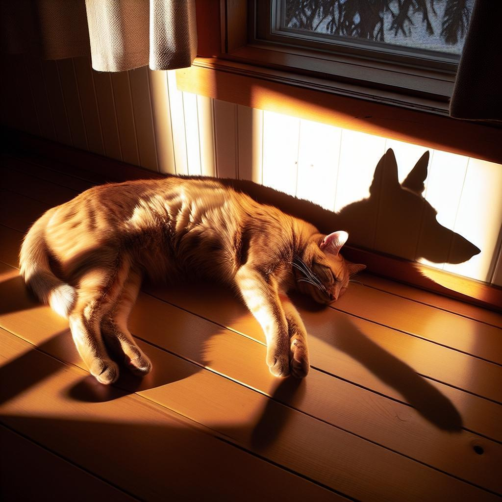

# Through the Looking Glass
This is a small subset of our WEIRD dataset, which we used to evaluate the Through the Looking Glass (TGL) approach to detecting common sense violations in images. There are 80 images (due to GitHub limitations) along with annotations in `data.jsonl`. The full version of the dataset contains 824 images.

WEIRD contains image scenes representing normal or weird situations. The data set is synthetically generated based on the WHOOPS! benchmark. 

|  |  |
|:--:|:--:|
| Absolutely normal image without any contradictions to our reality | Objects and beings in our world cannot cast the shadow of other objects and beings, so this image is strange |

Example of the dataset sample:
```
{
  'id': 11, # A unique id of the sample
  'path': 'images/image_11', # Path to the image
  'commonsense_violation_group': 'Object Function and Misuse', # The main group of the common sense violation manually annotated using generated subgroups
  'commonsense_violation_subgroup': 'Inappropriate tool usage', # The subgroup of the common sense violation generated by GPT
  'class': 'normal' # The class (normal / weird)
}
```

