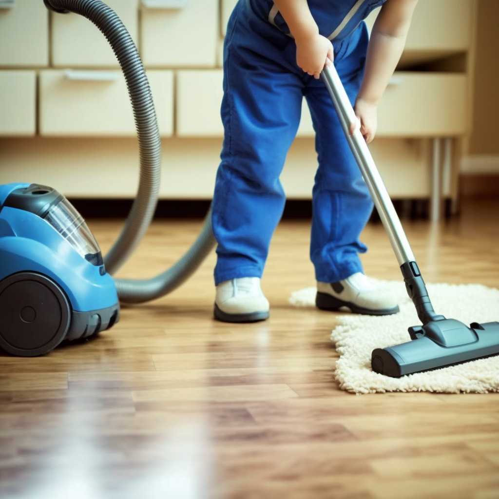

# Through the Looking Glass

Measuring how real images look is a complex task in artificial intelligence research. For example, an image of a boy with a vacuum cleaner in a desert violates common sense. We introduce a novel method, which we call Through the Looking Glass (TLG), to assess image common sense consistency using Large Vision-Language Models (LVLMs) and Transformer-based encoder. By leveraging LVLMs to extract atomic facts from these images, we obtain a mix of accurate facts. We proceed by fine-tuning a compact attention-pooling classifier over encoded atomic facts. Our TLG has achieved a new state-of-the-art performance on the WHOOPS! and WEIRD datasets while leveraging a compact fine-tuning component.

## TLG

Using the LVLM-generated atomic facts about the image, we train a classifier using hidden states from the textual encoder.


We use LVLMs to collect different atomic facts that describe different aspects of the scene in the image. To sample different facts we use the Diverse Beam Search. So, given an image $I$ and an LVLM, we sample N facts $F=\{ f_1, f_2, \dots, f_N \}$, where $F = \text{LVLM}(I)$.

Next, we use a frozen textual encoder to extract representations $H$ of the generated atomic facts

$$H_i = \text{Encoder}(f_i).$$

We compute a single fact representation $V_i$ by averaging the vectors of its tokens. Furthermore, we train an attention-based pooling classifier, which assings weights to individual representations: 

$$A = \text{softmax}(W_a V + b_a).$$

Finally, we classify the weighted average of representations by mapping it to a single common sense violation probability:

$$\text{prob} = \sigma(W_c v_{\text{weighted}} + b_c).$$

## Attention Scores Analysis

TLG assigns higher attention weights to facts that violate common sense. In this example, the fact `The vacuum cleaner is silver and purple` has a lower score than the more inconsistent fact `The man is using a vacuum cleaner on the beach`. As a result, TLG gives higher scores to more strange facts, meaning that TLG could also be used as a pure text reality ranker, rating the realism of text facts.

|  |  |
|-------------------------------------------|--------------------------------------------|
| *The child is vacuuming the floor* **0.60** | *The man is using a vacuum cleaner on the beach* **2.38** |
| *This is a photo of a child vacuuming the floor* **0.12** | *This image features a man vacuuming the beach* **1.65** |
| *A child vacuuming a wooden floor* **-0.28** | *The vacuum cleaner is silver* **-0.25** |

## WEIRD
See the full [WEIRD dataset](https://huggingface.co/datasets/MERA-evaluation/WEIRD) in HuggingFace.

We uploaded to GitHub a small subset of our WEIRD dataset, which we used to evaluate the Through the Looking Glass (TGL) approach to detecting common sense violations in images. There are 80 images along with annotations in `dataset.jsonl`. The full version of the dataset contains 824 images.

WEIRD contains image scenes representing normal or weird situations. The data set is synthetically generated based on the WHOOPS! benchmark. 

|  |  |
|:--:|:--:|
| Absolutely normal image without any contradictions to our reality | Objects and beings in our world cannot cast the shadow of other objects and beings, so this image is strange |

Example of the `dataset.jsonl` sample:
```
{
  'id': 11, # A unique id of the sample
  'path': 'images/image_11', # Path to the image
  'commonsense_violation_group': 'Object Function and Misuse', # The main group of the common sense violation manually annotated using generated subgroups
  'commonsense_violation_subgroup': 'Inappropriate tool usage', # The subgroup of the common sense violation generated by GPT
  'class': 'normal' # The class (normal / weird)
}
```

